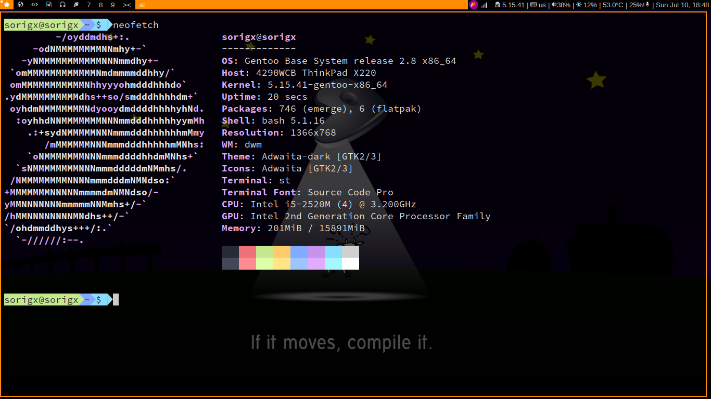

# dwm - dynamic window manager

dwm is an extremely fast, small, and dynamic window manager for X.

# Preview

# Defaults
- Terminal = st
- Launcher = dmenu
Default fonts are sans, JoyPixels, hack, IcoMoon-free.
For default key-bindings check config.def.h.

# Patches
I modified some patches.

List of applied patches:
- [Actual full screen](https://dwm.suckless.org/patches/actualfullscreen/)
- Alt-tab, This is my own patch. It'll be on the suckless website soon. Documentation is in patches/alt-tab/
- [Auto start](https://dwm.suckless.org/patches/autostart/)
- [Awesome bar](https://dwm.suckless.org/patches/awesomebar/)
- [Bottom stack](https://dwm.suckless.org/patches/bottomstack/)
- [Cycle layouts](https://dwm.suckless.org/patches/cyclelayouts/)
- [Full gaps](https://dwm.suckless.org/patches/fullgaps/)
- [Grid mode](https://dwm.suckless.org/patches/gridmode/)
- [Maximize](https://dwm.suckless.org/patches/maximize/)
- [Pertag](https://dwm.suckless.org/patches/pertag/)
- [Restarting](https://dwm.suckless.org/patches/restartsig/)
- RestoreAfterRestart, This is my own patch. It'll be on the suckless website soon. Documentation is in patches/restoreafterrestart/
- [Systray](https://dwm.suckless.org/patches/systray/)

# Dwmblocks
Dwmblocks is modular status bar written by [torrinfail](https://github.com/torrinfail/dwmblocks).
This project use my fork of dwmblocks.

# Requirements
In order to build dwm you need the Xlib header files.

# Installation
Edit config.mk to match your local setup (dwm is installed into
the /usr/local namespace by default).

Afterwards enter the following command to build and install dwm (if
necessary as root):

    make clean install

# Running dwm
Add the following line to your .xinitrc to start dwm using startx:

    exec dwm

In order to connect dwm to a specific display, make sure that
the DISPLAY environment variable is set correctly, e.g.:

    DISPLAY=foo.bar:1 exec dwm

(This will start dwm on display :1 of the host foo.bar.)

# Configuration
The configuration of dwm is done in config.def.h
and (re)compiling the source code (don't forget to delete config.h before compiling).

# Fake internet money
If you like my work and want to support me by some fake internet money, here is my monero address

87udnMjHcExZ43797qCeH7hV3saCfrx8GaW8Ung8UDzXXMve2bMyH4qH3jSZEuddQj8S3HB7DkCCkTrttbEKVCSENzaH2St
